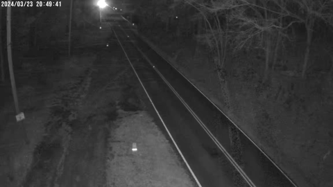

# CVLE 6860E AI & Informatics in Civil Engineering 

    

    🏛️ <a href="https://smil.engr.uga.edu/"><b>Smart Mobility and Infrastructure Lab</b></a>

## Week 4: Nighttime Vechicle Detection and Classification
The disproportionate risk of roadway fatalities on rural roads, where 43% of all roadway fatalities occur despite only 19% of the US population living in these areas, underscores a critical and worsening challenge in transportation safety. This is largely due to unique challenges associated with rural roads (e.g., varying roadway geometrics, frequent animal crossings, reduced cell phone and communication coverage). 

    

### Current bottlenecks and challenges:
* **Low Illumination and Contrast**: Nighttime environments suffer from poor lighting conditions, making it difficult for deep learning models to distinguish between vehicles and the background. Low illumination also reduces the overall image contrast, making it challenging for models to detect vehicle boundaries accurately.
* **Headlight and Reflection Glare**: The presence of strong headlight glare and reflections from vehicles can confuse the models, as these bright spots can either be misinterpreted as vehicles or obscure the actual objects of interest.
* **Noise and Low-Quality Images**: Nighttime images often suffer from noise, motion blur, and low resolution due to reduced sensor performance in low light. This degrades the quality of data used for detection and can negatively impact the model's accuracy.
* **Limited Training Data**: There is a scarcity of large, diverse, and annotated nighttime vehicle datasets. Models trained predominantly on daytime data do not generalize well to nighttime scenarios, leading to poor detection performance.
* **Domain Adaptation Issues**: Deep learning models that are trained on daytime images often perform poorly at night, as the features and environmental conditions differ significantly. Adapting models to function well across both daytime and nighttime scenarios is a major challenge.

   
<em>Nighttime Video from the Roadside Traffic Camera in California Highway</em>

   
<em>Nighttime Video from the Roadside Traffic Camera in South Carolina Highway</em>

   
<em>Daytime Detection and Classification via Raw YOLO12 Model</em>

   
<em>Nighttime Detection and Classification via Raw YOLO12 Model</em>

