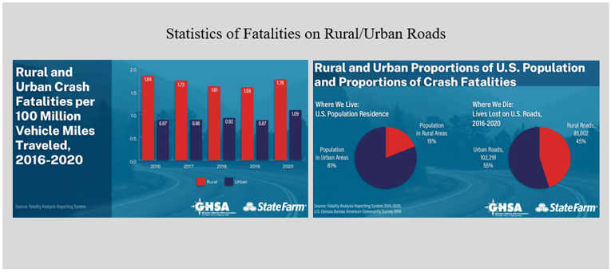
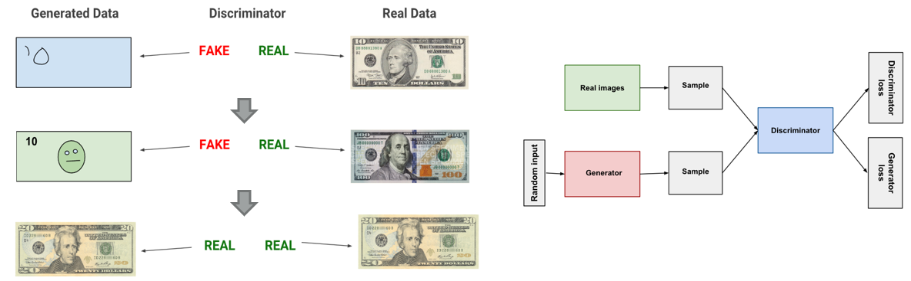
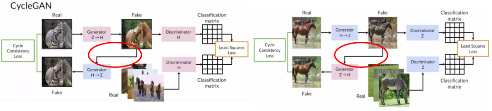

# CVLE 6860E AI & Informatics in Civil Engineering 

    

    🏛️ <a href="https://smil.engr.uga.edu/"><b>Smart Mobility and Infrastructure Lab</b></a>

## Week 4: Nighttime Vechicle Detection and Classification
The disproportionate risk of roadway fatalities on rural roads, where 43% of all roadway fatalities occur despite only 19% of the US population living in these areas, underscores a critical and worsening challenge in transportation safety. This is largely due to unique challenges associated with rural roads (e.g., varying roadway geometrics, frequent animal crossings, reduced cell phone and communication coverage). 

    

Nighttime vehicle detection is crucial for various transportation safety and automation systems. At night, reduced visibility due to low lighting conditions significantly increases the risk of traffic accidents. Detecting vehicles accurately during nighttime plays a key role in improving road safety, managing traffic, and enhancing the effectiveness of intelligent transportation systems (ITS).
Rural roads often lack the infrastructure and safety features found in cities, leading to higher accident rates, particularly at night.
Deploying deep learning models for nighttime vehicle detection offers significant advantages compared to traditional methods. Deep learning, particularly using convolutional neural networks (CNNs) and other advanced architectures, can effectively handle the challenges of low-light conditions, environmental variability, and complex data interpretation. 

### Current bottlenecks and challenges:
* **Low Illumination and Contrast**: Nighttime environments suffer from poor lighting conditions, making it difficult for deep learning models to distinguish between vehicles and the background. Low illumination also reduces the overall image contrast, making it challenging for models to detect vehicle boundaries accurately.
* **Headlight and Reflection Glare**: The presence of strong headlight glare and reflections from vehicles can confuse the models, as these bright spots can either be misinterpreted as vehicles or obscure the actual objects of interest.
* **Noise and Low-Quality Images**: Nighttime images often suffer from noise, motion blur, and low resolution due to reduced sensor performance in low light. This degrades the quality of data used for detection and can negatively impact the model's accuracy.
* **Limited Training Data**: There is a scarcity of large, diverse, and annotated nighttime vehicle datasets. Models trained predominantly on daytime data do not generalize well to nighttime scenarios, leading to poor detection performance.
* **Domain Adaptation Issues**: Deep learning models that are trained on daytime images often perform poorly at night, as the features and environmental conditions differ significantly. Adapting models to function well across both daytime and nighttime scenarios is a major challenge.

   
<em>Nighttime Video from the Roadside Traffic Camera in California Highway</em>

   
<em>Nighttime Video from the Roadside Traffic Camera in South Carolina Highway</em>

### AI Empowered Augmentation Methods - Generative Adversarial Network (GAN):
Typically, **GAN** includes 1 generator and 1 discriminator. The **generator** learns to generate plausible data. The generated instances become negative training examples for the discriminator.The **discriminator** learns to distinguish the generator's fake data from real data. The discriminator penalizes the generator for producing implausible results.

     
    
    <em>GAN architecture</em>
  

While **CycleGAN** (specialized for unpaired image-to-image translation.) is integrated with **2** Generators and **2** Discriminators, a generator gets an additional feedback from the other generator. This feedback ensure that an image generated by a generator is cycle consistent, meaning that applying consecutively both generators on an image should yield a similar image. 

   
  
    <em>CycleGAN architecture. Source: <a href="https://www.haikutechcenter.com/2020/11/cyclegan-gan-architecture-for-learning.html" target="_blank">
    Haiku Tech Center</a></em>
  

### Augmentation From Virtual - CARLA
* In order to address the resolution issue and find out the best angle for monitoring, we finished setting up CARLA to simulate and generate the high quality data we need. 
* CARLA has been developed from the ground up to support development, training, and validation of autonomous driving systems. In addition to open-source code and protocols, CARLA provides open digital assets (urban layouts, buildings, vehicles) that were created for this purpose and can be used freely. The simulation platform supports flexible specification of sensor suites, environmental conditions, full control of all static and dynamic actors, maps generation and much more.
* We turned off all the street lights and turned on the headlights (high beams)/taillights to best mimic the pure rural setting.
* We can record the video anytime we want and set the camera position anywhere we like. 

   
<em>Daytime Detection and Classification via Raw YOLO12 Model</em>

   
<em>Daytime Detection and Classification via Raw YOLO12 Model</em>

   
<em>Nighttime Detection and Classification via Raw YOLO12 Model</em>

